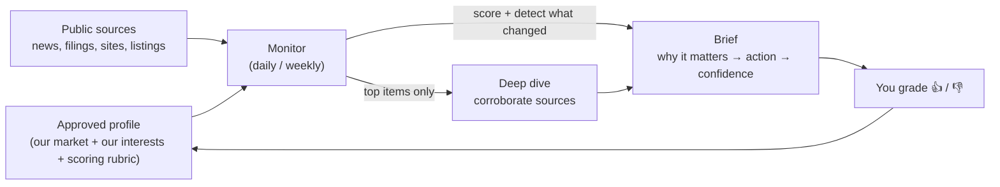

# Vantage Point — overview

*An autonomous market-intelligence agent: it watches a market through your team's lens
and delivers a short, sourced brief of what's new, what's changed, and why it matters —
and gets sharper every time you grade it.*

This is the plain-language explainer (for sharing with colleagues). For setup and
operations, see the [README](../README.md).

---

## TL;DR

- **What:** a self-hosted AI agent that monitors a market/space *for a specific
  stakeholder* and produces a daily/weekly intelligence brief.
- **Why it's different from alerts:** relevance is judged against **your** priorities,
  not in the abstract. It tells you *why something matters and what to do*, detects
  **trends** (not just events), **corroborates** before surfacing (no rumor spam), and
  **learns your taste** from thumbs-up/down.
- **Why it's safe to trust:** a human approves its understanding before it runs, it
  cites every source, it stays quiet on slow days, and it runs on infrastructure and a
  subscription **we already control** — no new vendor, public data stays where it is.

---

## The problem it solves

Business-development and competitive intelligence today is mostly manual and
inconsistent: someone skims headlines, sets up noisy Google Alerts, and "what actually
matters to us" lives in a few people's heads. The result is **missed signals** (a
competitor staffing up, a partner raising money, a quiet regulatory shift) and **noise
fatigue** (alerts that fire on everything and explain nothing).

Generic alerts tell you *something happened*. They don't tell you *whether it matters to
us, why, or what to do about it.*

## What makes it different

| Generic alerts / manual scanning | Vantage Point |
|---|---|
| Keyword matches, in the abstract | Scored against **our** interests and positioning (an "anchor") |
| A link with a headline | The **so-what for us** + a suggested action + a confidence level |
| Point-in-time events | **Trend detection** — price moves, repeated signals, hiring spikes over time |
| Repeats rumors | **Corroborates** across independent sources; flags the unconfirmed |
| Fires on everything | **Silence beats noise** — nothing on empty days |
| Static | **Learns** from your 👍/👎 and gets more relevant over time |

## How it works



1. **Profile (once).** The agent does deep research to build a profile of the market,
   *our* interests, and a scoring rubric — then **a human reviews and approves it.**
   Nothing is trusted until a person signs off (the quality gate).
2. **Monitor (daily/weekly).** It sweeps sources, scores each item against the profile,
   notices what's *changed* since last time, and — for the few highest-value items —
   does a deeper pass that **corroborates across multiple sources** before surfacing.
3. **Brief + learn.** It delivers a tight report (email and/or a dashboard). You thumb
   items up/down; the next refresh folds that feedback into the rubric.

## What you actually receive

A terse daily brief and a synthesized weekly digest. Illustrative daily:

```
[Vantage Point: <Our Market>] daily 2026-06-07
★ Bottom line: Acme acquired DataForge — a direct push into our core segment.

What changed
• [↑ over 3 wks] Acme solutions-engineering job posts: 4 → 11
  Staffing up presales in our wheelhouse; expect more competitive deals. (medium)

[threat]
• Acme acquires DataForge (TechCrunch)
  why: brings in-house the integration capability we win on; erodes a differentiator.
  do:  refresh the sales battlecard; flag roadmap gaps to product.
  corroboration: confirmed — also Reuters + company PR.
  → https://…  (high)

[opportunity]
• Partner X raised a Series C (PitchBook)
  why: fresh budget + expansion mandate — a co-sell/partnership window is open now.
  do:  warm intro via <exec>; revisit the co-sell deck.
  → https://…  (high)
```

Each report leads with the one thing to read, groups items by **opportunity / threat /
shift**, and every item carries its source so you can verify it in one click. A live
dashboard tracks watched entities over time with trend sparklines.

## How we could use it on the BD committee

Point it at our market and competitive set and it becomes a standing intelligence feed
for the committee:

| Goal | What it watches | What the committee gets |
|---|---|---|
| **Competitor intelligence** | named competitors | launches, pricing, partnerships, funding, exec/teams moves — tagged threat/opportunity with a battlecard-ready *so-what* |
| **Partner & target pipeline** | potential partners / acquisition targets | funding rounds, leadership changes, expansion — i.e. **engagement windows** opening or closing |
| **Market & whitespace shifts** | the category, new entrants, regulation | slow-burn trends, surfaced in the weekly digest before they're obvious |
| **Key accounts & counterparties** | named accounts | relationship-relevant signals worth a touchpoint |
| **Opportunity radar** | RFPs, awards, events, mandates | timely, relevant prompts — not a firehose |

Because each item arrives with *why it matters to us* and a *suggested action*, the
weekly digest can drop straight into a pipeline review or committee agenda.

## Why it's trustworthy

- **Human-in-the-loop.** A person approves the agent's understanding before it's used,
  and people make the decisions — it surfaces and interprets, it doesn't act on its own.
- **Corroboration.** High-value items are verified across independent sources; anything
  it can't confirm is flagged or downgraded, not amplified.
- **Cites everything.** Every surfaced item links to its source.
- **No noise.** It sends nothing when nothing's material — it won't train people to mute it.
- **Private & self-hosted.** It runs on a machine we control; it reads **public** sources
  and keeps our priorities and output local — no third-party SaaS ingesting our strategy.
- **Cost-bounded.** Runs on an existing Claude subscription, with guards on how much work
  each run can do.

## What it is *not*

- **Not insider/proprietary intel.** It works from public sources; it complements, not
  replaces, our own knowledge, relationships, and CRM.
- **Not an autopilot.** It's an analyst's assistant — humans decide and act.
- **Not real-time.** It runs on a daily/weekly cadence (by design — that's what makes the
  trend view possible and the cost low).
- **Only as good as its setup.** Quality depends on the approved profile and ongoing
  grading; it's a tool you calibrate, not a magic box.
- **AI, so fallible.** That's exactly why it corroborates, labels confidence, cites
  sources, and gates on human review.

## Piloting it

Low commitment, low cost:

1. **Pick a scope** — one market + one anchor (e.g., our competitive set, or a target
   list).
2. **Seed & approve** the profile (~30 minutes with someone who knows the space).
3. **Run it for 2–3 weeks**, spending ~2 minutes a day grading items so it calibrates.
4. **Review the weekly digest** at committee and decide if it earns a standing slot.

If it's not pulling its weight, we stop — nothing is locked in, and it can be re-pointed
at a different market by swapping the config and re-running the research step.

## Under the hood (for the curious)

Two Claude agents over one config file: a one-time **research** pass that builds the
reviewed profile, and a lightweight **monitor** that runs on a schedule. It's a small,
auditable codebase (shell + a little Python) with a CI test suite, scheduled via the
OS's own task runner. Full technical detail is in the [README](../README.md) and the
[roadmap](roadmap.md).
