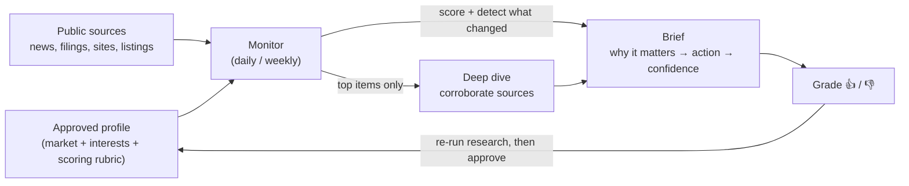

# Vantage Point — overview

*An autonomous market-intelligence agent: it watches a market through a chosen lens and
delivers a short, sourced brief of what's new, what's changed, and why it matters — and
gets sharper every time it's graded.*

This is the plain-language explainer of what Vantage Point is and how it can be used.
For setup and operations, see the [README](../README.md).

---

## TL;DR

- **What:** a self-hosted AI agent that monitors a market/space *for a specific
  stakeholder* and produces a daily/weekly intelligence brief.
- **Why it's different from alerts:** relevance is judged against a defined set of
  priorities, not in the abstract. It explains *why something matters and what to do*,
  detects **trends** (not just events), **corroborates** before surfacing (no rumor
  spam), and **learns** from thumbs-up/down feedback.
- **Why it's trustworthy:** a human approves its understanding before anything runs, it
  cites every source, and it runs on your own machine and existing Claude subscription —
  no extra vendor to onboard. (The analysis runs *through* Claude, so the profile and the
  content it reads are sent to Anthropic like any Claude Code use — see the data note
  under [Why it's trustworthy](#why-its-trustworthy).)

---

## The problem it solves

Competitive and market intelligence is usually manual and inconsistent: someone skims
headlines, sets up noisy keyword alerts, and "what actually matters here" lives in a few
people's heads. The result is **missed signals** (a competitor staffing up, a partner
raising money, a quiet regulatory shift) and **noise fatigue** (alerts that fire on
everything and explain nothing).

Generic alerts tell you *something happened*. They don't tell you *whether it matters,
why, or what to do about it.*

## What makes it different

| Generic alerts / manual scanning | Vantage Point |
|---|---|
| Keyword matches, in the abstract | Scored against a defined stakeholder's interests (an "anchor") |
| A link with a headline | The **so-what** + a suggested action + a confidence level |
| Point-in-time events | **Trend detection** — price moves, repeated signals, hiring spikes over time |
| Repeats rumors | **Corroborates** across independent sources (optional deep-dive pass); flags the unconfirmed |
| Fires on everything | **Silence beats noise** — nothing on empty days (once tuned) |
| Static | **Learns** from 👍/👎 feedback and gets more relevant over time |

## How it works



1. **Profile (once).** The agent does deep research to build a profile of the market,
   the stakeholder's interests, and a scoring rubric — then **a human reviews and
   approves it.** Nothing is trusted until a person signs off (the quality gate).
2. **Monitor (daily/weekly).** It sweeps sources, scores each item against the profile,
   and notices what's *changed* since last time. With the optional **deep-dive** pass
   enabled, the few highest-value items get a deeper look that **corroborates across
   multiple sources** before surfacing.
3. **Brief + learn.** It delivers a tight report (email and/or a dashboard). Items get
   graded up/down, and those grades feed the **next profile refresh** — a re-run of the
   research step that you review and approve. Grading sharpens relevance at the next
   refresh; it doesn't change scoring automatically mid-stream.

## What you actually receive

A terse daily brief and a synthesized weekly digest. An illustrative daily report:

```
[Vantage Point: Example Market] daily 2026-06-07
★ Bottom line: Acme acquired DataForge — a direct push into the core segment.

What changed
• [↑ over 3 wks] Acme solutions-engineering job posts: 4 → 11
  Staffing up presales in this space; expect more competitive deals. (medium)

[threat]
• Acme acquires DataForge (TechCrunch)
  why: brings in-house an integration capability others compete on; erodes a differentiator.
  do:  refresh the sales battlecard; flag roadmap gaps to product.
  corroboration: confirmed — also Reuters + company PR.
  → https://…  (high)

[opportunity]
• Partner X raised a Series C (PitchBook)
  why: fresh budget + expansion mandate — a co-sell/partnership window is open now.
  do:  warm intro via a mutual contact; revisit the co-sell deck.
  → https://…  (high)
```

Each report leads with the one thing to read, groups items by **opportunity / threat /
shift**, and every item carries its source so it can be verified in one click. A live
dashboard tracks watched entities over time with trend sparklines.

## What you can point it at

Define a market and the stakeholder whose interests define relevance, and it becomes a
standing intelligence feed. Common uses:

| Goal | What it watches | What you get |
|---|---|---|
| **Competitor intelligence** | named competitors | launches, pricing, partnerships, funding, team moves — tagged threat/opportunity with a ready-to-use *so-what* |
| **Partner & target pipeline** | potential partners / acquisition targets | funding rounds, leadership changes, expansion — i.e. **engagement windows** opening or closing |
| **Market & whitespace shifts** | the category, new entrants, regulation | slow-burn trends, surfaced in the weekly digest before they're obvious |
| **Key accounts & counterparties** | named accounts | relationship-relevant signals worth a touchpoint |
| **Opportunity radar** | RFPs, awards, events, mandates | timely, relevant prompts — not a firehose |

Because each item arrives with *why it matters* and a *suggested action*, the weekly
digest can drop straight into a review meeting or planning agenda.

## Why it's trustworthy

- **Human-in-the-loop.** A person approves the agent's understanding before it's used,
  and people make the decisions — it surfaces and interprets, it doesn't act on its own.
- **Corroboration (when enabled).** With the optional deep-dive pass turned on, high-value
  items are verified across independent sources and anything unconfirmed is flagged or
  downgraded. (Without it, the monitor is single-pass — items are scored and surfaced but
  not independently cross-checked.)
- **Cites everything.** Every surfaced item links to its source, so it's one click to verify.
- **No noise (once tuned).** A tuned monitor stays silent on days with nothing material.
  During initial calibration a "near-misses" tuning aid is on by default and can still
  send a short digest on quiet days; you switch it off once the rubric is dialed in.
- **Self-hosted, no extra vendor.** It runs on a machine you control on your existing
  Claude subscription — there's no additional SaaS product collecting your data, and the
  reports/state stay on your box. **Data note:** the analysis runs *through* Claude, so
  the profile/config and the public content it reads are sent to Anthropic as part of
  normal Claude Code usage. Treat the config the way you'd treat anything you send your
  LLM provider, and govern sensitive material under your Claude/Anthropic data terms.
- **Cost-bounded.** Runs on an existing Claude subscription, with guards on how much work
  each run can do.

## What it is *not*

- **Not insider/proprietary intel.** It works from public sources; it complements, not
  replaces, internal knowledge, relationships, and a CRM.
- **Not an autopilot.** It's an analyst's assistant — humans decide and act.
- **Not real-time.** It runs on a daily/weekly cadence (by design — that's what makes the
  trend view possible and the cost low).
- **Only as good as its setup.** Quality depends on the approved profile and ongoing
  grading; it's a tool you calibrate, not a magic box.
- **AI, so fallible.** That's exactly why it corroborates, labels confidence, cites
  sources, and gates on human review.

## Trying it out

Low commitment, low cost:

1. **Pick a scope** — one market + one anchor (e.g., a competitive set, or a target list).
2. **Seed & approve** the profile (~30 minutes with someone who knows the space).
3. **Run it for 2–3 weeks**, spending ~2 minutes a day grading items. Partway through,
   **re-run the research step** to fold those grades into a refreshed, re-approved profile
   — that's when relevance visibly improves (grading alone doesn't change scoring until
   the refresh).
4. **Review the weekly digest** and decide whether it earns a standing slot. Once the
   rubric feels right, turn off the borderline tuning aid for quieter empty days.

Nothing is locked in — if it's not pulling its weight, stop. It can be re-pointed at a
different market by swapping the config and re-running the research step.

## Under the hood (for the curious)

Two Claude agents over one config file: a one-time **research** pass that builds the
reviewed profile, and a lightweight **monitor** that runs on a schedule. It's a small,
auditable codebase (shell + a little Python) with a CI test suite, scheduled via the
OS's own task runner. Full technical detail is in the [README](../README.md) and the
[roadmap](roadmap.md).
