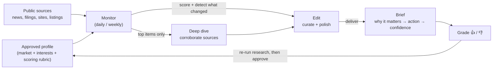

# Vantage Point — overview

*An autonomous market-intelligence agent: it watches a market through a chosen lens and
delivers a short, sourced brief of what's new, what's changed, and why it matters — and
gets sharper every time it's graded.*

This is the plain-language explainer of what Vantage Point is and how it can be used.
For setup and operations, see the [README](../README.md).

---

## TL;DR

- **What:** a self-hosted AI agent that monitors a market/space *for a specific
  stakeholder* and delivers a daily/weekly intelligence brief — as a designed HTML
  email and a live dashboard, not a wall of links.
- **Why it's different from alerts:** relevance is judged against a defined set of
  priorities, not in the abstract. It explains *why something matters and what to do*,
  detects **trends** (not just events), **corroborates** before surfacing (no rumor
  spam), and **learns** from thumbs-up/down feedback.
- **Why it's trustworthy:** a human approves its understanding before anything runs, it
  cites every source, and it runs on your own machine and existing Claude subscription —
  no extra vendor to onboard. (The analysis runs *through* Claude, so the profile and the
  content it reads are sent to Anthropic like any Claude Code use — see the data note
  under [Why it's trustworthy](#why-its-trustworthy).)
- **One engine, any market.** The same tool re-points at a new domain by swapping the
  config and re-running the research step — competitor intel, a partner/target pipeline,
  AI-model releases, OSS/dependency security, policy. Ready-made starter configs ship in
  [`samples/`](../samples/).

---

## The problem it solves

Competitive and market intelligence is usually manual and inconsistent: someone skims
headlines, sets up noisy keyword alerts, and "what actually matters here" lives in a few
people's heads. The result is **missed signals** (a competitor staffing up, a partner
raising money, a quiet regulatory shift) and **noise fatigue** (alerts that fire on
everything and explain nothing).

Generic alerts tell you *something happened*. They don't tell you *whether it matters,
why, or what to do about it.*

## What makes it different

| Generic alerts / manual scanning | Vantage Point |
|---|---|
| Keyword matches, in the abstract | Scored against a defined stakeholder's interests (an "anchor") |
| A link with a headline | The **so-what** + a suggested action + a confidence level |
| Point-in-time events | **Trend detection** — price moves, repeated signals, hiring spikes over time |
| Repeats rumors | **Corroborates** across independent sources (optional deep-dive pass); flags the unconfirmed |
| Fires on everything | **Silence beats noise** — nothing on empty days (once tuned) |
| Static | **Learns** from 👍/👎 feedback and gets more relevant over time |

## How it works



1. **Profile (once).** The agent does deep research to build a profile of the market,
   the stakeholder's interests, and a scoring rubric — then **a human reviews and
   approves it.** Nothing is trusted until a person signs off (the quality gate).
   It can email you a readable summary of that draft (what it inferred, plus its
   lowest-confidence guesses) so you can review from your inbox; approving stays a
   deliberate step you take, not something the email does for you.
2. **Monitor (daily/weekly).** It sweeps sources, scores each item against the profile,
   and notices what's *changed* since last time. With the optional **deep-dive** pass
   enabled, the few highest-value items get a deeper look that **corroborates across
   multiple sources** before surfacing.
3. **Brief + learn.** It delivers a tight report — as a designed **HTML email** and in a
   browsable **web portal** — with an optional **editorial** pass that first curates and
   polishes it into a designed brief (lead, order, cut, tighten) without adding facts or
   dropping citations. Items are graded up/down from the portal's **one-click Review tab**, and those
   grades feed the **next profile refresh** — a re-run of the research step that you
   review and approve. Grading sharpens relevance at the next refresh; it doesn't change
   scoring automatically mid-stream.

## What you set up

Configuration is a single YAML file built on one idea: relevance is the *relationship*
between a news item and a defined stakeholder — the **subject** (what to watch) crossed
with the **anchor** (whose interests decide what matters). You write a short config; the
research pass turns it into a full profile you then approve. An abbreviated config (a
watch collector, here — the full template is `monitor-config.example.yaml`):

```yaml
subject:                       # WHAT to watch — the market
  name: "Mechanical & microbrand wristwatches"
  seeds: [hodinkee.com, wornandwound.com, chrono24.com]   # expand outward from these
  scope:
    in:  ["new releases", "microbrand drops", "limited editions", "price movement"]
    out: ["smartwatches", "fashion-brand quartz"]

anchor:                        # WHOSE interests define relevance
  name: "Me — collector"
  type: persona
  relationship_to_subject: collector
  seeds:
    taste:
      likes:    ["integrated-bracelet sport watches", "in-house movements",
                 "sub-$2k microbrands with real finishing"]
      dislikes: ["homage/clone designs", "oversized fashion pieces"]

relevance:
  threshold: 0.6               # items scoring below this are dropped silently

# ...plus monitoring cadence, trend tracking, output, and governance — all with
# sane defaults. The `derived:` blocks start empty; the research pass fills them.
```

Run the research pass and it deep-researches the market and the anchor, then writes a
**profile** — the durable artifact the daily monitor scores against. You review and
approve it (a literal file promotion: `cp profile.draft.yaml profile.yaml`) before the
monitor will trust it. An abbreviated look at what it produces:

```yaml
# profile.yaml — written by research, then reviewed and approved by a human
subject:
  derived:
    structure: >
      Three tiers — luxury houses (Rolex/Patek/AP), accessible mechanical
      ($500–$5k), and independent microbrands. Releases break on enthusiast
      blogs first; secondary-price signals live on Chrono24.
    key_players:
      - { name: "Tudor",            why: "integrated-bracelet sport watches squarely in the anchor's band" }
      - { name: "Christopher Ward", why: "microbrand now shipping in-house movements with real finishing" }
      - { name: "Grand Seiko",      why: "in-house movements, high finishing — adjacent to the taste" }
    news_sources:                                  # RANKED: where news breaks first
      - { name: "Hodinkee",     why: "breaks major releases first" }
      - { name: "Worn & Wound", why: "deepest microbrand coverage" }
      - { name: "Chrono24",     why: "secondary-market price signal" }
    event_taxonomy: ["new release", "reissue", "limited edition", "price move", "auction result"]
    last_bootstrapped: 2026-05-10
    confidence_notes: >
      Confident on the majors; less sure which microbrands the anchor rates — flagged
      the borderline ones for review.

anchor:
  derived:
    interests: ["integrated-bracelet sport watches under $2k", "independent watchmaking",
                "in-house movement finishing"]
    peer_or_competitive_set: ["Tudor", "Christopher Ward", "Baltic", "Lorier"]
    signal_definitions:                            # what counts as a signal, in the anchor's terms
      opportunity: "a tracked reference dropping into buy range, or a new indie release matching the taste"
      shift:       "a structural move — a microbrand going in-house, a price-tier realignment"

relevance:
  threshold: 0.6
  rubric: >
    +++ integrated-bracelet sport watch, in-house movement, independent maker, sub-$2k with real finishing
    +   reissue/limited edition from a key player; a tracked ref moving on price
    --- homage/clone designs, oversized fashion quartz, general lifestyle content
  calibration:                                     # graded examples — the biggest quality lever
    relevant:     [{ item: "Christopher Ward goes in-house on The Twelve", why: "indie + in-house, exactly the taste" }]
    not_relevant: [{ item: "Brand X drops a 44mm fashion chronograph",     why: "oversized fashion quartz — out of scope" }]
```

Because the profile is a plain, diffable file, the review gate is concrete: you read
exactly what the agent inferred (and the low-confidence guesses it flagged), correct it,
and approve it — nothing is trusted until you do.

## What you actually receive

A terse daily brief and a synthesized weekly digest. The agent authors each report as
**Markdown** — which stays readable as plain text *and* renders into a designed HTML
email. The raw report looks like this:

```markdown
> **Bottom line:** Christopher Ward put an in-house movement in The Twelve — an indie hitting your taste at sub-$2k.

## What changed
- **[↓ 12%] Tudor Black Bay 58** secondary_price_usd: $3,650 → $3,200 over 3 weeks — sliding into your tracked-buy zone _(medium)_

## Opportunities
- **Christopher Ward unveils in-house cal. for The Twelve** `[a1b2c3d4]` — independent maker going in-house at sub-$2k, squarely your profile.
  [Worn & Wound](https://…) _(high)_ — *Do:* read the hands-on; compare the finishing to the SH21.

## Shifts
- **Microbrands moving in-house is accelerating** `[e5f6a7b8]` — the finishing/value bar is rising across the segment you buy in.
  [Hodinkee](https://…) _(medium)_
```

Delivered, that's not raw text — it's a **polished HTML brief**: a header card (a
"Vantage Point" eyebrow, the market name as the title, a `Daily briefing — <date>`
subtitle), a hidden inbox preheader, a highlighted **bottom-line callout**, clean
uppercase section dividers, and every source as a one-click link. Each report leads with the one thing to read, groups items by
**opportunity / threat / shift**, and carries *why it matters → suggested action →
confidence* on each. The weekly digest adds a styled **Watchlist status** table with
unicode **sparklines** so each tracked entity's trend reads at a glance:

```
Watchlist status
| Entity              | Latest        | Recent  | Note                      |
|---------------------|---------------|---------|---------------------------|
| Tudor Black Bay 58  | $3,200 (↓12%) | ▇▆▅▃▂▁  | dipping; tracked-buy zone |
| Pelagos 39          | 4 listings    | ▁▂▂▃    | quiet                     |
```

The optional **editorial pass** polishes the brief one more step before it ships (leads
with the strongest finding, cuts the marginal, tightens the prose) without adding facts
or dropping citations. The same data also feeds a **web portal** (`bin/portal.sh`): an
Overview of watched entities with their latest metric and a sparkline, recent events,
and recent runs — plus every report rendered in place, the grading UI, and read-only
profile/config views. A static `kb/index.html` snapshot of the Overview is written each
run too, so there's something to read with no server and no email required.

(Email is optional — reports always land in `kb/` regardless; the HTML rendering uses a
lightweight Markdown renderer if one is installed and falls back to clean plain text
otherwise. See the [README](../README.md) for delivery setup.)

## What you can point it at

Define a market and the stakeholder whose interests define relevance, and it becomes a
standing intelligence feed. Common uses:

| Goal | What it watches | What you get |
|---|---|---|
| **Competitor intelligence** | named competitors | launches, pricing, partnerships, funding, team moves — tagged threat/opportunity with a ready-to-use *so-what* |
| **Partner & target pipeline** | potential partners / acquisition targets | funding rounds, leadership changes, expansion — i.e. **engagement windows** opening or closing |
| **Market & whitespace shifts** | the category, new entrants, regulation | slow-burn trends, surfaced in the weekly digest before they're obvious |
| **Key accounts & counterparties** | named accounts | relationship-relevant signals worth a touchpoint |
| **Opportunity radar** | RFPs, awards, events, mandates | timely, relevant prompts — not a firehose |

Because each item arrives with *why it matters* and a *suggested action*, the weekly
digest can drop straight into a review meeting or planning agenda.

## Why it's trustworthy

- **Human-in-the-loop.** A person approves the agent's understanding before it's used,
  and people make the decisions — it surfaces and interprets, it doesn't act on its own.
- **Corroboration (when enabled).** With the optional deep-dive pass turned on, high-value
  items are verified across independent sources and anything unconfirmed is flagged or
  downgraded. (Without it, the monitor is single-pass — items are scored and surfaced but
  not independently cross-checked.)
- **Cites everything.** Every surfaced item links to its source, so it's one click to verify.
- **No noise (once tuned).** A tuned monitor stays silent on days with nothing material.
  During initial calibration a "near-misses" tuning aid is on by default and can still
  send a short digest on quiet days; you switch it off once the rubric is dialed in.
- **Self-hosted, no extra vendor.** It runs on a machine you control on your existing
  Claude subscription — there's no additional SaaS product collecting your data, and the
  reports/state stay on your box. **Data note:** the analysis runs *through* Claude, so
  the profile/config and the public content it reads are sent to Anthropic as part of
  normal Claude Code usage. Treat the config the way you'd treat anything you send your
  LLM provider, and govern sensitive material under your Claude/Anthropic data terms.
- **Cost-bounded.** Runs on an existing Claude subscription, with guards on how much work
  each run can do.

## What it is *not*

- **Not insider/proprietary intel.** It works from public sources; it complements, not
  replaces, internal knowledge, relationships, and a CRM.
- **Not an autopilot.** It's an analyst's assistant — humans decide and act.
- **Not real-time.** It runs on a daily/weekly cadence (by design — that's what makes the
  trend view possible and the cost low).
- **Only as good as its setup.** Quality depends on the approved profile and ongoing
  grading; it's a tool you calibrate, not a magic box.
- **AI, so fallible.** That's exactly why it corroborates, labels confidence, cites
  sources, and gates on human review.

## Trying it out

Low commitment, low cost:

1. **Pick a scope** — one market + one anchor (e.g., a competitive set, or a target list).
2. **Seed & approve** the profile (~30 minutes with someone who knows the space).
3. **Run it for 2–3 weeks**, spending ~2 minutes a day grading items. Partway through,
   **re-run the research step** to fold those grades into a refreshed, re-approved profile
   — that's when relevance visibly improves (grading alone doesn't change scoring until
   the refresh).
4. **Review the weekly digest** and decide whether it earns a standing slot. Once the
   rubric feels right, turn off the borderline tuning aid for quieter empty days.

Nothing is locked in — if it's not pulling its weight, stop. It can be re-pointed at a
different market by swapping the config and re-running the research step.

## Under the hood (for the curious)

Two Claude agents over one config file: a one-time **research** pass that builds the
reviewed profile, and a lightweight **monitor** that runs on a schedule (with optional
deep-dive and editorial passes layered on top). It's a small, auditable codebase (shell +
a little Python, no heavy dependencies) with a CI test suite, scheduled via the OS's own
task runner. It's built to run unattended: per-run locking, wall-clock timeouts, bounded
state, and fail-safe optional steps (a failed email or deep-dive never loses a good
report). One machine can watch several markets at once — one isolated clone per market.
Full technical detail is in the [README](../README.md) and the [roadmap](roadmap.md).
