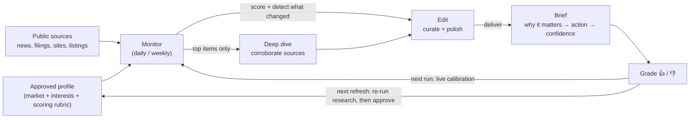
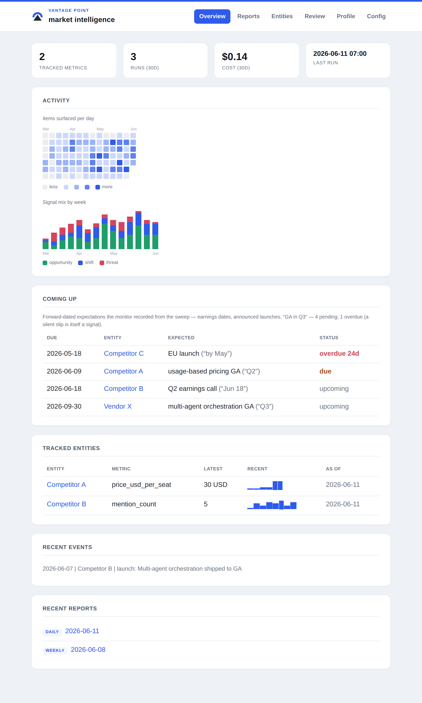

# Vantage Point — overview

*An autonomous market-intelligence agent: it watches a market through a chosen lens and
delivers a short, sourced brief of what's new, what's changed, and why it matters — and
gets sharper every time it's graded.*

This is the plain-language explainer of what Vantage Point is and how it can be used.
For setup and operations, see the [README](../README.md).

---

## TL;DR

- **What:** a self-hosted AI agent that monitors a market/space *for a specific
  stakeholder* and delivers a daily/weekly intelligence brief — as a designed HTML
  email and a live dashboard, not a wall of links.
- **Why it's different from alerts:** relevance is judged against a defined set of
  priorities, not in the abstract. It explains *why something matters and what to do*,
  detects **trends** (not just events), **corroborates** before surfacing (no rumor
  spam), and **learns** from thumbs-up/down feedback.
- **Why it's trustworthy:** a human approves its understanding before anything runs, it
  cites every source, and it runs on your own machine and existing Claude subscription —
  no extra vendor to onboard. (The analysis runs *through* Claude, so the profile and the
  content it reads are sent to Anthropic like any Claude Code use — see the data note
  under [Why it's trustworthy](#why-its-trustworthy).)
- **One engine, any market.** The same tool re-points at a new domain by swapping the
  config and re-running the research step — competitor intel, a partner/target pipeline,
  AI-model releases, OSS/dependency security, policy. Ready-made starter configs ship in
  [`samples/`](../samples/).

---

## The problem it solves

Competitive and market intelligence is usually manual and inconsistent: someone skims
headlines, sets up noisy keyword alerts, and "what actually matters here" lives in a few
people's heads. The result is **missed signals** (a competitor staffing up, a partner
raising money, a quiet regulatory shift) and **noise fatigue** (alerts that fire on
everything and explain nothing).

Generic alerts tell you *something happened*. They don't tell you *whether it matters,
why, or what to do about it.*

## What makes it different

| Generic alerts / manual scanning | Vantage Point |
|---|---|
| Keyword matches, in the abstract | Scored against a defined stakeholder's interests (an "anchor") |
| A link with a headline | The **so-what** + a suggested action + a confidence level |
| Point-in-time events | **Trend detection** — price moves, repeated signals, hiring spikes over time |
| Looks only backward | **Forward radar** — records announced dates ("GA in Q3") and flags the ones that silently slip |
| Repeats rumors | **Corroborates** across independent sources (optional deep-dive pass); flags the unconfirmed |
| Fires on everything | **Silence beats noise** — nothing on empty days (once tuned) |
| Static | **Learns** from 👍/👎 feedback and "it missed this" reports — applied from the next run — and **shows you its measured precision** over time |

## How it works



1. **Profile (once).** The agent does deep research to build a profile of the market,
   the stakeholder's interests, and a scoring rubric — then **a human reviews and
   approves it.** Nothing is trusted until a person signs off (the quality gate).
   It can email you a readable summary of that draft (what it inferred, plus its
   lowest-confidence guesses) so you can review from your inbox; approving stays a
   deliberate step you take, not something the email does for you. For the hardest
   profiles, an optional **deep-research mode** does this the way Claude's own Deep
   Research works — a lead plans the investigation, parallel researchers each dig into
   one facet with a fresh context, and a synthesis pass writes the draft from their
   notes — then it verifies the draft's feeds and runs an adversarial pass that tries
   to *break* its weakest claims before you ever see it. (Off by default; the everyday
   single-pass research is unchanged.)
2. **Monitor (daily/weekly).** It sweeps sources and scores each item against the
   profile, and notices what's *changed* since last time. Sources with an RSS/Atom
   feed (the research step finds and verifies these) are pulled **deterministically**
   first — so for those sources, "what was swept" is a recorded fact, not whatever the
   agent happened to browse — and the agent's own browsing covers the rest. With the
   optional **deep-dive** pass enabled, the few highest-value items get a deeper look
   that **corroborates across multiple sources** before surfacing.
3. **Brief + learn.** It delivers a tight report — as a designed **HTML email**, in a
   browsable **web portal**, and optionally into a **Slack/Discord channel or any
   webhook** — with an optional **editorial** pass that first curates and
   polishes it into a designed brief (lead, order, cut, tighten) without adding facts or
   dropping citations. Items are graded up/down from the portal's **one-click Review
   tab**, and grades take effect on two clocks: the newest ones are applied as **live
   calibration on the very next run** (a thumbs-down filters its lookalikes the next
   morning), and the **next profile refresh** — a re-run of the research step that you
   review and approve — consolidates all of them into the rubric durably (the refresh
   review is a short *what changed* diff against the approved profile, not a re-read,
   plus a **backtest** that replays your graded items against the new rubric so you can
   see what *effect* it has — its agreement with your verdicts, and any thumbs-up it
   would now drop — before approving). Spotted
   something relevant it *never* surfaced? Report the URL as a **missed signal** from
   the same tab and it's treated as a false negative on both clocks. The portal
   also *measures* the loop: a Calibration view tracks precision week by week (with
   reported misses counted alongside), so "it's getting sharper" is a chart, not a
   feeling.

## What you set up

Configuration is a single YAML file built on one idea: relevance is the *relationship*
between a news item and a defined stakeholder — the **subject** (what to watch) crossed
with the **anchor** (whose interests decide what matters). You write a short config; the
research pass turns it into a full profile you then approve. And you don't have to write
it cold: `bin/init.sh` is a guided interview that asks for exactly these fields —
starting from any ready-made [`samples/`](../samples/) config — and writes the file for
you, with an optional review step that suggests sharper scope lines and seeds for you to
approve or reject. An abbreviated config (a
competitive-intelligence team, here — the full template is `monitor-config.example.yaml`):

```yaml
subject:                       # WHAT to watch — the market
  name: "Enterprise AI platforms & LLM products"
  seeds: [news.ycombinator.com, techcrunch.com, venturebeat.com]   # expand outward from these
  scope:
    in:  ["product & model launches", "pricing & packaging changes",
          "funding, M&A & partnerships", "integrations & platform moves"]
    out: ["minor point releases", "vendor marketing fluff", "job postings"]

anchor:                        # WHOSE interests define relevance
  name: "Acme AI — product & strategy team"
  type: organization
  relationship_to_subject: competitor
  seeds:
    profile:
      product:        ["an AI agent platform for support teams"]
      competitors:    ["<competitor A>", "<competitor B>", "<competitor C>"]
      roadmap_themes: ["multi-agent orchestration", "eval tooling", "usage-based pricing"]

relevance:
  threshold: 0.6               # items scoring below this are dropped silently

# ...plus monitoring cadence, trend tracking, output, and governance — all with
# sane defaults. The `derived:` blocks start empty; the research pass fills them.
```

Run the research pass and it deep-researches the market and the anchor, then writes a
**profile** — the durable artifact the daily monitor scores against. You review and
approve it (a literal file promotion: `cp profile.draft.yaml profile.yaml`) before the
monitor will trust it. An abbreviated look at what it produces:

```yaml
# profile.yaml — written by research, then reviewed and approved by a human
subject:
  derived:
    structure: >
      Three layers — frontier-model providers (OpenAI/Anthropic/Google), AI app &
      agent platforms, and infra/tooling. Launches break on vendor blogs + HN first;
      pricing and packaging live on vendors' own pricing pages.
    key_players:
      - { name: "OpenAI",    why: "sets the pace on model + API capability and pricing" }
      - { name: "Anthropic", why: "direct competitor on enterprise agent platforms" }
      - { name: "LangChain", why: "ecosystem tooling that shapes how buyers integrate" }
    news_sources:                                  # RANKED: where news breaks first
      - { name: "Hacker News", why: "launches + candid practitioner sentiment first" }
      - { name: "TechCrunch",  why: "funding, M&A, partnerships" }
      - { name: "Vendor blogs/changelogs", why: "authoritative on features + pricing" }
    event_taxonomy: ["model/product launch", "pricing change", "funding/M&A", "partnership", "benchmark"]
    last_bootstrapped: 2026-05-10
    confidence_notes: >
      Confident on the major providers; less sure which mid-market tools you treat as
      direct competitors — flagged the borderline ones for review.

anchor:
  derived:
    interests: ["agent-platform launches & capabilities", "usage-based pricing moves",
                "eval/observability tooling", "enterprise integrations & partnerships"]
    peer_or_competitive_set: ["<competitor A>", "<competitor B>", "Anthropic", "LangChain"]
    signal_definitions:                            # what counts as a signal, in the anchor's terms
      opportunity: "a gap a competitor leaves, or a partner/integration opening you could take"
      threat:      "a rival ships a headline capability on your roadmap, or undercuts your pricing"
      shift:       "a structural move — a pricing model or standard the market is converging on"

relevance:
  threshold: 0.6
  rubric: >
    +++ a direct competitor's launch/pricing/funding; a capability on your roadmap; an integration opening
    +   an adjacent platform move or benchmark that changes how buyers choose
    --- minor point releases, vendor marketing fluff, generic AI explainers, job postings
  calibration:                                     # graded examples — the biggest quality lever
    relevant:     [{ item: "Competitor B ships multi-agent orchestration (GA)", why: "headline feature on our roadmap" }]
    not_relevant: [{ item: "Vendor X posts a 'future of AI' thought-leadership blog", why: "marketing fluff — out of scope" }]
```

Because the profile is a plain, diffable file, the review gate is concrete: you read
exactly what the agent inferred (and the low-confidence guesses it flagged), correct it,
and approve it — nothing is trusted until you do. On a *refresh* the gate gets two
review aids: a diff of what changed against the approved profile, and a backtest that
re-scores your already-graded items under the new rubric (blind, on the monitor model)
and reports how often it agrees with your verdicts — so you can confirm the refresh
demonstrably matches your judgment, not just that the YAML reads right.

## What you actually receive

A terse daily brief and a synthesized weekly digest. The agent authors each report as
**Markdown** — which stays readable as plain text *and* renders into a designed HTML
email. The raw report looks like this:

```markdown
> **Bottom line:** Competitor B shipped multi-agent orchestration to GA — a headline capability squarely on your roadmap.

## What changed
- **[↑ 2.4×] Competitor B** mention_count: spiked vs its trailing baseline over 3 days — launch-driven attention _(medium)_

## Threats
- **Competitor B ships multi-agent orchestration (GA)** `[a1b2c3d4]` — a capability you'd planned to lead on, now shipping first.
  [Hacker News](https://…) _(high)_ — *Do:* pull their docs; gap-check against our beta and tighten the launch timeline.

## Shifts
- **Usage-based pricing is becoming the default for agent platforms** `[e5f6a7b8]` — buyers increasingly expect per-run pricing across the segment.
  [TechCrunch](https://…) _(medium)_
```

Delivered, that's not raw text — it's a **polished HTML brief**: a header card (a
"Vantage Point" eyebrow, the market name as the title, a `Daily briefing — <date>`
subtitle), a hidden inbox preheader, a highlighted **bottom-line callout**, clean
uppercase section dividers, and every source as a one-click link. Each report leads with the one thing to read, groups items by
**opportunity / threat / shift**, and carries *why it matters → suggested action →
confidence* on each. The weekly digest adds a styled **Watchlist status** table with
unicode **sparklines** so each tracked entity's trend reads at a glance:

```
Watchlist status
| Entity        | Latest          | Recent  | Note                         |
|---------------|-----------------|---------|------------------------------|
| Competitor B  | 2.4× mentions   | ▁▂▃▆▇█  | launch spike; on our roadmap |
| Competitor A  | $30/seat (↑20%) | ▂▃▃▄    | raised pricing               |
```

The weekly digest also closes with a **forward radar** — a deterministic *Coming up*
table of the dated expectations the monitor has been collecting from the sweep
(earnings dates, "GA in Q3", announced launch windows), so the brief looks ahead and
not only back:

```
## Coming up
| When       | Entity        | Expected                       | Status |
|------------|---------------|--------------------------------|--------|
| Thu Jun 18 | Competitor B  | Q2 earnings call               | due    |
| ~Sep (Q3)  | Vendor X      | multi-agent orchestration GA   |        |

Overdue / unconfirmed:
- Competitor C's EU launch was expected "by May" -- 12 days past, unconfirmed.
```

The real payoff is the *overdue* line: an announced date that passes in silence (a
slipped roadmap, a quiet cancellation) used to vanish unnoticed; now the monitor
records the expectation, re-checks it as it comes due, and surfaces the slip as a
finding. It costs nothing extra — recording rides the existing triage pass, and the
arithmetic and rendering are plain Python.

Unannounced silences get the same treatment via **quiet detection** (the dog that
didn't bark): from the recorded event history, each tracked entity gets a normal
rhythm (the median gap between its events), and an entity silent well past that
baseline is flagged on the weekly for the monitor to verify and — when it's genuinely
quiet — surface under *Quiet on* with the numbers: "no release in 8 weeks vs a
~3-week norm." A reported silence won't re-alarm week after week; the flag resets
when the entity resumes.

The optional **editorial pass** polishes the brief one more step before it ships (leads
with the strongest finding, cuts the marginal, tightens the prose) without adding facts
or dropping citations. The same data also feeds a **web portal** (`bin/portal.sh`): an
Overview with an activity heatmap (items surfaced per day) and a weekly signal-mix chart,
watched entities with their latest metric and a sparkline, recent events, and recent runs
— plus every report rendered in place, the grading UI, and read-only profile/config views.
Once you start grading it adds a **Calibration** view (precision over graded items, week
by week, with grading coverage and per-source hit rates). And because briefs are
perishable, an **Entities** tab keeps a **dossier per tracked entity** — its metric
history, event timeline, and every item ever surfaced about it — that compounds the
longer the monitor runs: walking into a meeting with six sourced months on a competitor
is where the accumulated state pays off. The Overview also carries a **Coming up** card
(the forward radar's pending expectations, overdue ones flagged), and each dossier an
**Expected** list, so a competitor's announced-and-slipped dates are visible at a
glance — plus a **Cadence** line on its event timeline (the entity's normal rhythm,
flagged when its current silence is well past it).
The charts are server-rendered inline SVG, so there's no JavaScript and nothing to load.



A [report rendered in the portal](img/portal-reports.png) (same styling as the email),
the [Review tab](img/portal-review.png) for thumbing items up/down, and a
[per-entity dossier](img/portal-entity.png) with its **Expected** list (the forward
radar's announced-and-slipped dates) and **Cadence** line (the entity's normal rhythm
vs its current silence). A static `kb/index.html` snapshot of the Overview is written each
run too, so there's something to read with no server and no email required.

(Delivery is optional — reports always land in `kb/` regardless. Email renders as HTML
when a lightweight Markdown renderer is installed and falls back to clean plain text;
a webhook URL additionally posts each report to Slack, Discord, or any service of your
own. See the [README](../README.md) for delivery setup.)

## What you can point it at

Define a market and the stakeholder whose interests define relevance, and it becomes a
standing intelligence feed. Common uses:

| Goal | What it watches | What you get |
|---|---|---|
| **Competitor intelligence** | named competitors | launches, pricing, partnerships, funding, team moves — tagged threat/opportunity with a ready-to-use *so-what* |
| **Partner & target pipeline** | potential partners / acquisition targets | funding rounds, leadership changes, expansion — i.e. **engagement windows** opening or closing |
| **Market & whitespace shifts** | the category, new entrants, regulation | slow-burn trends, surfaced in the weekly digest before they're obvious |
| **Key accounts & counterparties** | named accounts | relationship-relevant signals worth a touchpoint |
| **Opportunity radar** | RFPs, awards, events, mandates | timely, relevant prompts — not a firehose |

Because each item arrives with *why it matters* and a *suggested action*, the weekly
digest can drop straight into a review meeting or planning agenda.

## Why it's trustworthy

- **Human-in-the-loop.** A person approves the agent's understanding before it's used,
  and people make the decisions — it surfaces and interprets, it doesn't act on its own.
- **Corroboration (when enabled).** With the optional deep-dive pass turned on, high-value
  items are verified across independent sources and anything unconfirmed is flagged or
  downgraded. (Without it, the monitor is single-pass — items are scored and surfaced but
  not independently cross-checked.)
- **Cites everything.** Every surfaced item links to its source, so it's one click to verify.
- **No noise (once tuned).** A tuned monitor stays silent on days with nothing material.
  During initial calibration a "near-misses" tuning aid is on by default and can still
  send a short digest on quiet days; you switch it off once the rubric is dialed in.
- **Self-hosted, no extra vendor.** It runs on a machine you control on your existing
  Claude subscription — there's no additional SaaS product collecting your data, and the
  reports/state stay on your box. **Data note:** the analysis runs *through* Claude, so
  the profile/config and the public content it reads are sent to Anthropic as part of
  normal Claude Code usage. Treat the config the way you'd treat anything you send your
  LLM provider, and govern sensitive material under your Claude/Anthropic data terms.
- **Cost-bounded.** Runs on an existing Claude subscription, with guards on how much work
  each run can do.

## What it is *not*

- **Not insider/proprietary intel.** It works from public sources; it complements, not
  replaces, internal knowledge, relationships, and a CRM.
- **Not an autopilot.** It's an analyst's assistant — humans decide and act.
- **Not real-time.** It runs on a daily/weekly cadence (by design — that's what makes the
  trend view possible and the cost low).
- **Only as good as its setup.** Quality depends on the approved profile and ongoing
  grading; it's a tool you calibrate, not a magic box.
- **AI, so fallible.** That's exactly why it corroborates, labels confidence, cites
  sources, and gates on human review.

## Trying it out

Low commitment, low cost:

1. **Pick a scope** — one market + one anchor (e.g., a competitive set, or a target list).
2. **Seed & approve** the profile (~30 minutes with someone who knows the space).
3. **Run it for 2–3 weeks**, spending ~2 minutes a day grading items. Each grade is
   applied as live calibration on the very next run, and the portal's Calibration view
   shows precision improving (or not) week by week. Partway through, **re-run the
   research step** to consolidate those grades into a refreshed, re-approved profile.
4. **Review the weekly digest** and decide whether it earns a standing slot. Once the
   rubric feels right, turn off the borderline tuning aid for quieter empty days.

Nothing is locked in — if it's not pulling its weight, stop. It can be re-pointed at a
different market by swapping the config and re-running the research step.

## Under the hood (for the curious)

Two Claude agents over one config file: a one-time **research** pass that builds the
reviewed profile, and a lightweight **monitor** that runs on a schedule (with optional
deep-dive and editorial passes layered on top). The research pass can optionally fan out
into a **multi-agent pipeline** — a planner, parallel facet researchers with fresh
contexts, a synthesizer, and an adversarial challenger — orchestrated as separate,
individually-budgeted processes rather than one long context. It's a small, auditable codebase (shell +
a little Python, no heavy dependencies) with a CI test suite, scheduled via the OS's own
task runner. It's built to run unattended: per-run locking, wall-clock timeouts, bounded
state, and fail-safe optional steps (a failed email or deep-dive never loses a good
report). One machine can watch several markets at once — one isolated clone per market.
Full technical detail is in the [README](../README.md) and the [roadmap](roadmap.md).
